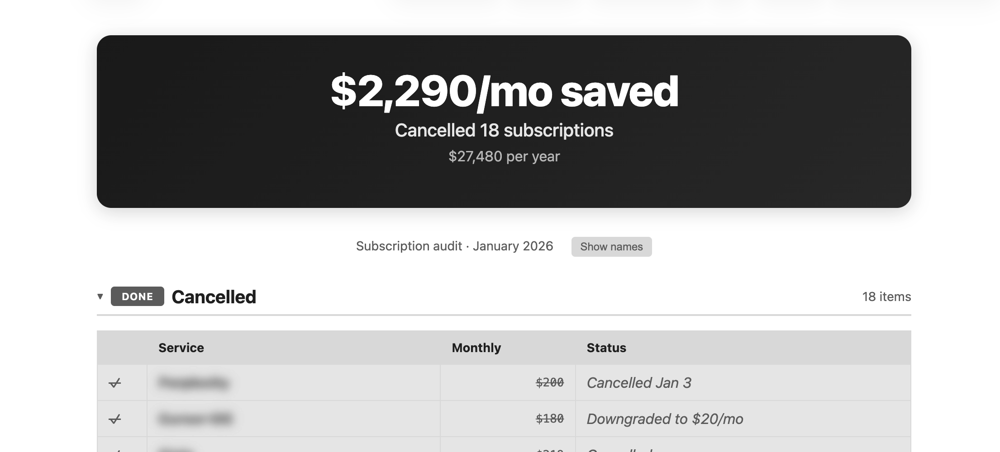

# Subscription Audit

Analyze your bank transactions to find recurring charges, categorize them, and cancel what you don't need.



## What it does

1. **Analyzes** your transaction history for recurring charges
2. **Categorizes** subscriptions (cancel / investigate / keep)
3. **Generates** an interactive HTML audit with privacy controls
4. **Helps cancel** subscriptions via browser automation (optional)

## Privacy

**Your data stays on your computer.** This tool runs entirely through Claude Code on your local machine. Your transaction data is:
- Never uploaded to any server
- Never shared with the skill author
- Only processed locally by Claude on your device

The generated HTML audit also stays local - share only if you choose to.

## Requirements

- [Claude Code](https://claude.ai/download) installed
- Bank/card transaction export (CSV from Apple Card, Chase, Mint, etc.)

## Usage

```
# In your terminal, navigate to a folder and run:
claude

# Then tell Claude:
"Audit my subscriptions"

# Drop your transaction CSV when prompted
```

Claude will ask clarifying questions about your usage patterns, then generate an interactive audit.

## Output Features

- **Share card** - Screenshot-ready savings summary (no service names)
- **Privacy toggle** - Blur service names with one click
- **Collapsible sections** - Click headers to collapse/expand
- **Categorized view** - Cancelled, Needs Decision, Keeping

---

New to Claude Code? See [GETTING_STARTED.md](GETTING_STARTED.md)
